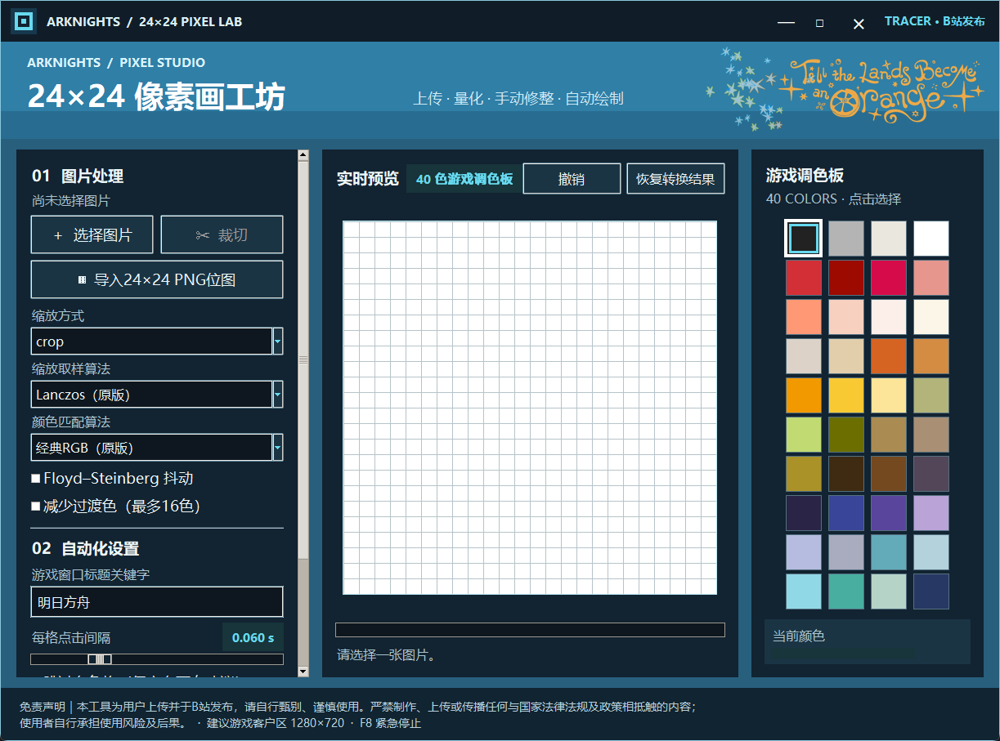

# 明日方舟 24×24 像素画自动填色

一个面向 Windows 的明日方舟 PC 客户端辅助工具，可将用户选择的图片转换为游戏40色调色板下的 `24×24` 像素画，并在用户确认后自动填入游戏编辑画布。

## 界面预览



> 截图中的山景为使用内置40色调色板绘制的演示图案，不包含用户图片。

## 主要功能

- 将本地图片缩放和量化为 `24×24` 像素画。
- 上传图片后可通过独立裁切窗口移动、缩放并1:1裁切需要的区域。
- 映射到游戏内40种可用颜色。
- 支持 `crop`、`contain` 和 `stretch` 三种图片适配方式。
- 可选 Floyd–Steinberg 抖动。
- 支持在24×24预览区内手动涂色、吸色、撤销和恢复转换结果。
- 自动定位明日方舟 Unity 游戏窗口。
- 自动识别24×24网格线，减少不同DPI下的累计坐标偏差。
- 自动切换和滚动右侧调色板。
- 支持不同游戏客户区分辨率，并根据实际客户区和识别到的网格动态换算坐标。
- 支持1080p、2K、4K等不同屏幕分辨率、多显示器布局及不同Windows缩放倍率。
- 支持 `F8` 紧急停止。
- 工具窗口会按当前屏幕工作区、分辨率和DPI确定初始尺寸，并常驻Windows任务栏。
- 支持整体拖动、边缘缩放、最大化及响应式布局；预览画布和调色板会随可用空间调整。

## 使用前必读

> [!IMPORTANT]
> 请使用明日方舟 **PC 客户端**。本工具不针对手机端、安卓模拟器、云游戏或远程桌面做兼容保证。

工具已经适配不同游戏客户区分辨率、屏幕分辨率和Windows显示缩放倍率。自动填色时会读取游戏实际客户区位置，并优先识别24×24网格进行坐标校准；工具界面也会根据当前工作区和DPI自适应。

不同游戏版本、显卡缩放方式及系统DPI组合仍可能影响图像识别。为获得最稳定的坐标和调色板操作，建议优先使用以下设置：

| 项目 | 建议设置 |
| --- | --- |
| 游戏客户端 | 明日方舟 PC 客户端 |
| Windows 显示缩放 | 支持不同倍率，**100% 最稳定** |
| 游戏 UI 缩放 | 支持校准适配，**100% 强烈推荐** |
| 游戏客户区分辨率 | 支持多种分辨率，**1280×720 强烈推荐** |
| 窗口模式 | 窗口化或无边框窗口，不要跨两块屏幕 |
| 界面状态 | 24×24编辑画布和右侧调色板完整可见 |

换言之，多分辨率与多缩放倍率属于已支持场景，而不是必须固定为1280×720才能运行；但 `游戏客户区 1280×720 + 游戏 UI 100%` 是测试最充分、成功率最高的推荐组合。Windows显示缩放也建议优先使用100%。

## Windows 显示缩放设置

1. 打开 Windows **设置**。
2. 进入 **系统 → 屏幕**。
3. 找到 **缩放** 或 **缩放与布局**。
4. 工具支持100%、125%、150%、200%等常见缩放倍率；如出现定位偏差，优先将运行游戏的显示器调整为 **100%**。
5. 使用双屏时允许显示器采用不同分辨率和缩放倍率，但游戏窗口必须完整位于同一块显示器内，不要跨屏。
6. 修改缩放倍率后，建议重新启动游戏和本工具，让双方重新读取DPI状态。

## 使用方法

### 1. 准备游戏

1. 启动明日方舟 PC 客户端。
2. 工具支持不同游戏UI缩放状态，但建议将游戏 UI 缩放调整为 **100%**。
3. 工具支持多种游戏客户区分辨率，但建议调整为 **1280×720**。
4. 进入24×24像素画编辑页。
5. 确保画布和右侧调色板没有被聊天窗口、浏览器或其他程序遮挡。

### 2. 导入和调整图片

1. 运行本工具。
2. 点击 **选择图片**，选择后会自动打开裁切窗口。
3. 在裁切窗口中：
   - 拖动裁切框内部：移动裁切区域。
   - 拖动四个角：改变裁切区域大小。
   - 鼠标滚轮：以中心为基准缩放裁切框。
   - **重置裁切**：恢复默认的1:1裁切区。
   - **应用裁切**：将选中区域用于后续24×24转换。
4. 如需再次调整，点击主界面的 **裁切** 按钮。
5. 根据需要选择缩放方式：
   - `crop`：居中裁剪为正方形，画面会铺满24×24网格。
   - `contain`：保留完整画面，空白部分用白色填充。
   - `stretch`：不保持原始比例，直接拉伸到24×24。
6. 根据需要开启 **Floyd–Steinberg 抖动**。
7. 在中央预览区检查转换结果。

### 3. 手动修改像素画

- 在右侧调色板中点击需要的颜色。
- 预览区左键点击或拖动：涂色。
- 预览区右键：吸取当前格子颜色。
- **撤销**：撤销上一次手动笔画。
- **恢复转换结果**：放弃手动修改，恢复到当前图片的转换结果。

### 4. 调整工具窗口

- 按住顶部自定义标题栏拖动，可以移动整个工具窗口。
- 拖动窗口四边或四角，可以拉大窗口；为避免控件被裁掉，窗口不能缩小到初始尺寸以下。
- 点击标题栏右上角的最大化按钮，或双击标题栏，可以最大化/还原窗口。
- 拉大窗口后，中央24×24预览会自动使用更多空间，并始终保持24等分，避免手动涂色坐标错位。
- 右侧调色板会根据可用区域重新计算色块大小，颜色选择位置会同步更新。
- 窗口可从Windows任务栏最小化和恢复；如果任务栏仍显示旧行为，请完全退出旧版本后再启动新版程序。

### 5. 开始自动填色

1. 确认 **游戏窗口标题关键字** 为 `明日方舟`。
2. 建议保持默认每格点击间隔 `0.060 s`。
3. **跳过白色格** 仅适用于游戏画布已经是纯白底色的情况。
4. 点击 **开始自动填充**。
5. 确认提示后，工具会切换到游戏窗口，截取当前客户区并尝试识别实际网格。
6. 自动填色过程中不要移动鼠标、切换窗口、改变游戏分辨率或拖动游戏窗口。
7. 如需紧急停止，按 `F8`。

## 自动校准状态

填色完成后，工具底部会显示定位状态：

- `定位：自动校准 xxx×xxx px`：成功识别游戏当前24×24网格。
- `定位：比例坐标`：自动识别未通过，工具已回退到固定比例坐标。此时请重点检查UI缩放、分辨率和画面遮挡。

## 常见问题

### 找不到游戏窗口

- 确认使用的是PC客户端。
- 确认游戏已经启动，且窗口没有完全最小化。
- 将窗口标题关键字恢复为 `明日方舟`。

### 鼠标在游戏内不移动

- 如果游戏以管理员身份运行，本工具也需使用相同权限运行。
- 也可关闭游戏的“以管理员身份运行”，然后重新启动两个程序。

### 出现整行或整列空白

- 多分辨率和缩放倍率虽已支持，但排查问题时请先恢复为游戏客户区1280×720、游戏UI缩放100%。
- 如果仍有偏差，再将运行游戏的显示器缩放调整为100%，并重新启动游戏和工具。
- 确认画布没有被其他窗口遮挡。
- 检查完成状态是否显示“自动校准”。

### 调色板颜色选偏或无法下拉

- 将游戏UI缩放恢复为100%。
- 使用1280×720窗口，并保证右侧调色板完整可见。
- 在开始填色前不要将其他窗口覆盖在调色板上。
- 尝试将每格点击间隔调整为 `0.080 s` 或更高。

### 双屏环境错位

- 确认 Windows 使用“扩展这些显示器”，而不是复制模式。
- 支持显示器使用不同分辨率和缩放倍率；发生错位时，可暂时将运行游戏的显示器改为100%缩放进行排查。
- 将游戏窗口完整放在某一块显示器内，不要跨屏。

### 工具窗口无法拉大或拖动时内容没有跟随

- 请确认运行的是最新生成的 `明日方舟像素画自动填色.exe`，而不是旧版或带其他后缀的测试版本。
- 完全退出任务管理器中的旧版程序后再启动新版。
- 可拖动窗口边缘或四角调整大小，也可双击顶部标题栏最大化。

## 运行源码

需要 Windows、Python 3.10 或更高版本。

```powershell
git clone https://github.com/JayJokerr/arknights-pixel-autofill.git
cd arknights-pixel-autofill
py -m venv .venv
.\.venv\Scripts\Activate.ps1
pip install -r requirements.txt
python arknights_pixel_autofill.py
```

## 打包 EXE

```powershell
pip install -r requirements-dev.txt
pyinstaller --noconfirm --clean arknights_pixel_autofill.spec
```

打包结果位于 `dist/`。本地 `assets/` 为可选界面素材且不纳入Git；缺少时仍可运行和打包，但界面不会显示这些装饰图片。

## 项目结构

- `arknights_pixel_autofill.py`：主程序。
- `arknights_pixel_autofill.spec`：PyInstaller打包配置。
- `requirements.txt`：运行依赖。
- `requirements-dev.txt`：打包和开发依赖。
- `assets/`：本地可选界面素材，不纳入Git。
- `reference_assets/`：本地参考素材，不纳入Git。
- `tests/samples/`：本地手动测试图片，不纳入Git。
- `dist/`：本地发行文件，不纳入Git。

## 使用声明

本项目为用户上传和自行使用的辅助工具，与游戏官方无关。请使用者自行判断相关游戏规则、账号风险及素材授权，并承担使用后果。

严禁使用本工具制作、上传或传播与国家法律法规及政策相抵触的内容。
