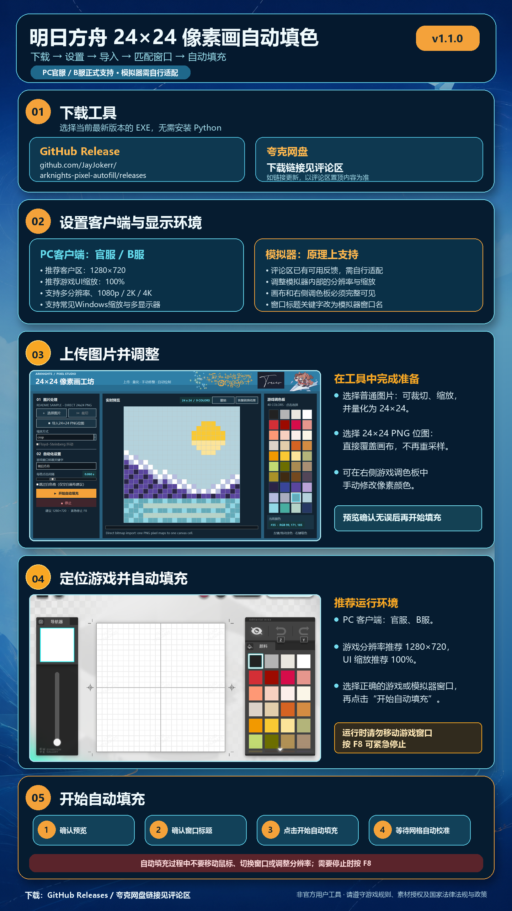
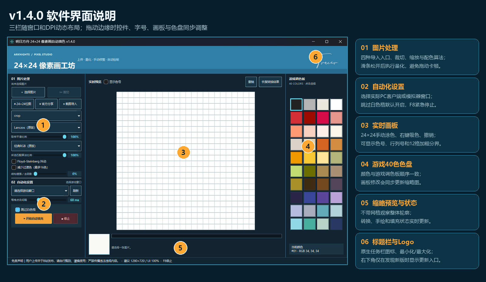
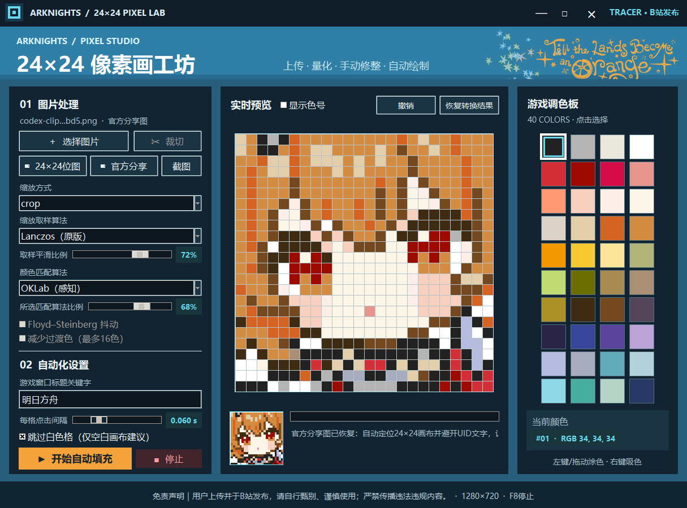
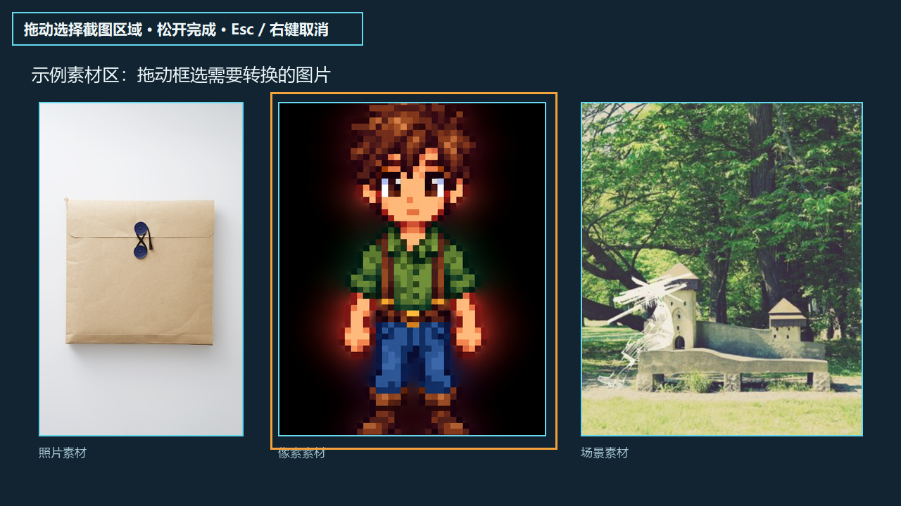
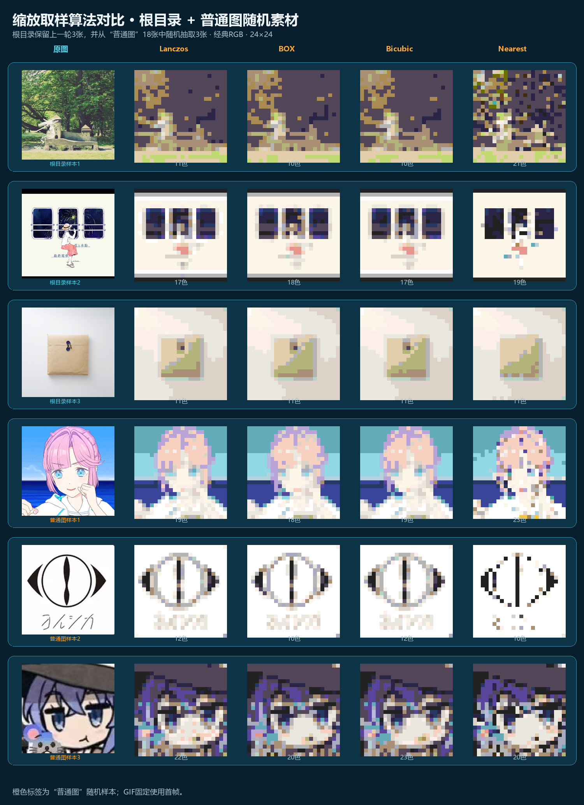
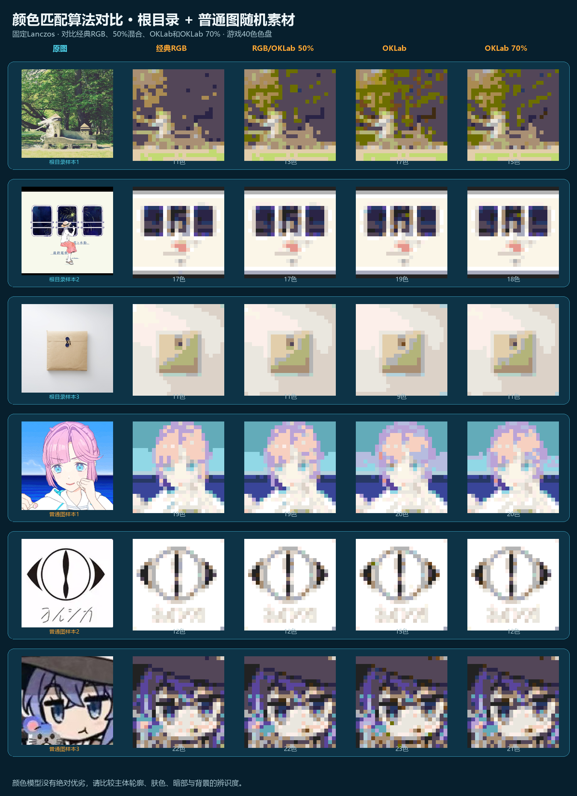
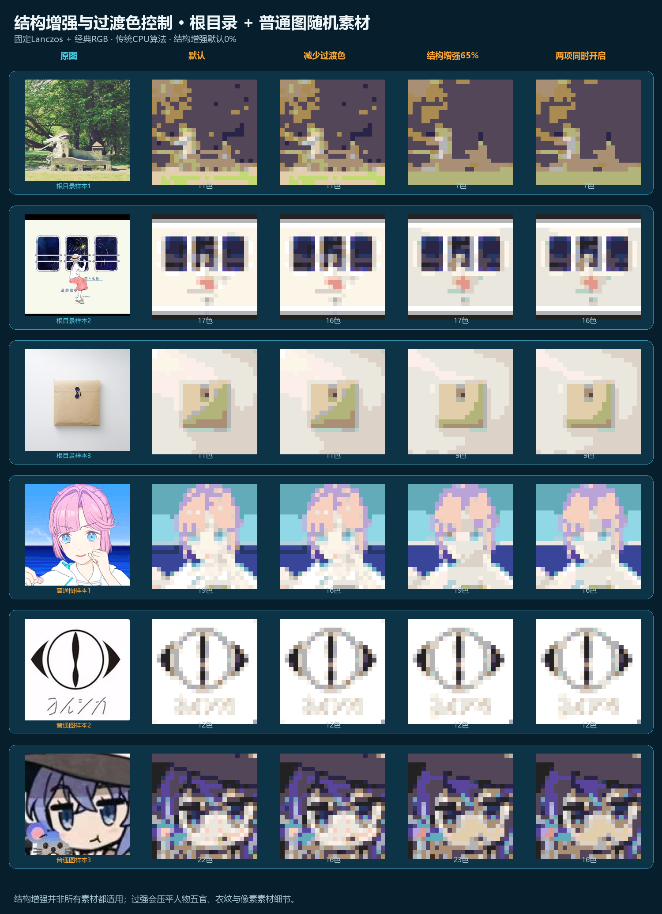

# 明日方舟 24×24 像素画自动填色

一个面向 Windows 的明日方舟像素画辅助工具。它可以把普通图片转换为游戏40色色盘下的 `24×24` 像素画，也可以导入已经制作好的24×24位图或官方分享图；用户确认、修改后，再自动填入游戏编辑画布。

当前版本：**v1.4.0**。界面已迁移到 **PySide6 / Qt 6**，自动填充采用画布与调色板动态识别，不再依赖某个固定分辨率或模拟器品牌的坐标偏移。

## 下载

- GitHub：[Releases](https://github.com/JayJokerr/arknights-pixel-autofill/releases)
- 夸克网盘：链接见B站发布页评论区或置顶评论
- 软件启动时会自动请求管理员权限，取消 UAC 后会提示并退出

### v1.4.0 文件校验与 Windows 提示

- 文件名：`Arknights-Pixel-Autofill-v1.4.0.exe`
- SHA-256：`06929354526EF9F36EA97A63222848A21321CEED30C616D4F62ED069E88FE6D5`

当前发行文件暂未使用商业代码签名证书。Windows SmartScreen 可能会对下载量较少的新程序显示信誉提示，这不等同于已经检出恶意代码。请只从本项目 GitHub Releases 或作者发布页下载，并在运行前核对文件名和 SHA-256；文件来源或校验值不一致时不要运行。

## 一图流使用指南



## v1.4.0 软件界面




界面分为三栏：左侧负责导入、裁切、算法与自动化设置；中间负责24×24预览、手动修改和缩略预览；右侧提供与游戏顺序一致的40色调色板。拖动窗口边缘时，字号、按钮、栏宽、画板和色盘会随当前窗口及DPI一起调整。

## 已实测兼容范围

以下结论来自实际填充测试，不是只运行到主界面的理论兼容：

| 类型 | 已测试内容 | 结果 |
| --- | --- | --- |
| PC客户端 | 官服、B服 | 正常使用 |
| PC分辨率 | 1280×720、1920×1080、2560×1440、3840×2160；正常比例、非异形屏 | 正常使用 |
| 游戏UI缩放 | 90%–100% | 正常使用 |
| 安卓模拟器 | MuMu模拟器 | 正常使用 |
| MuMu分辨率 | 1280×720、1920×1080、2560×1440 | 正常使用 |

因此当前版本正式支持 **PC官服、PC B服**，并支持经过实测的 **MuMu模拟器**。其他安卓模拟器由于尚未逐一实测，只能视为原理上兼容，不应直接写成已经验证。

> [!IMPORTANT]
> MuMu窗口如果被手动缩得太小，内部渲染画面可能按不同缩放方式显示，程序会无法稳定识别画布或调色板。请把模拟器窗口拉大或切换全屏，确保游戏画布和右侧调色板完整、清晰可见后再开始。

虽然多分辨率和90%–100%游戏UI缩放均已通过测试，最推荐的排障基准仍然是：

- 游戏客户区：`1280×720`
- 游戏UI缩放：`100%`
- 游戏窗口完整位于同一块显示器内
- 24×24画布与右侧调色板没有被其他窗口遮挡

手机端、云游戏、远程桌面、异形比例窗口和未实测模拟器不在当前实测保证范围内。

## 从 v1.3.0 到 v1.4.0 的完整更新

### 1. PySide6响应式界面

- 主界面从Tk迁移到PySide6 / Qt 6，使用原生布局管理器处理不同分辨率和DPI。
- 窗口可以拖动边缘缩放、最大化、最小化；调整过程中三栏连续刷新，不需要松开鼠标后才重新布局。
- 左侧按钮、文字、滑条和自动填充区域按同一密度缩放；“选择图片”和“裁切”保持等宽。
- 中央画板始终保持24的整数倍尺寸，右侧色盘按可用空间计算色块大小。
- 缩略图在手动画板拖动期间实时同步，不必等待松开鼠标。
- 算法滑条拖动时只刷新轻量显示，松开或短暂停顿后再执行完整量化，降低卡顿。
- Tracer Logo改为透明背景并保持在右上区域；补充窗口图标、任务栏图标和原生最小化/最大化按钮。

### 2. 游戏窗口选择与通用渲染窗口发现

- 由“填写窗口标题关键字”改为 **刷新并从下拉列表选择实际窗口**。
- 列表显示窗口标题、客户区尺寸与PID，方便区分PC客户端、模拟器和重名窗口。
- 选择模拟器外层窗口后，程序会搜索与其存在进程、父子或所有者关系的实际渲染客户区，不按MuMu、雷电等品牌写死偏移。
- 候选渲染画面会去重并逐一截图；16:9仅用于优先排序，不作为强制接受条件。

### 3. 24×24画布动态识别

- 同时运行两种传统视觉检测器并统一评分：
  - 寻找接近正方形的长外框，再严格等分为24×24；
  - 拟合横纵各25条等间距网格线，检查间距、顺序与残差。
- 使用画布比例、正方形程度、调色板相对位置和预期区域共同排除导航器缩略图、窗口外框等误识别。
- 基准坐标只作为搜索先验，最终点击位置来自识别到的相邻网格线中心。
- 如果没有同时识别到画布和调色板，程序会停止，不再使用猜测比例坐标强行点击。

### 4. 调色板动态识别与滚动验证

- 自动识别右侧调色板的4列、6个可见行、色块中心和当前全局色号区间。
- 通过色块中位数与完整40色色盘顺序比较，判断色盘当前位于顶部还是下拉区域。
- 色盘滚动后重新截图识别；若滚轮结果不正确，再尝试拖动实际滚动条并再次验证。
- 所需色号仍不可见时直接停止，避免从错误行列继续选择颜色。

### 5. 模拟器与鼠标输入安全

- PC Unity客户端保留相对鼠标兼容路径；模拟器使用确定性的绝对坐标移动，减少指针加速导致的甩动。
- 自动填充期间把系统光标限制在选中的游戏客户区，并将每次目标坐标限制在安全边界内。
- 每次选色和点击格子前检查渲染窗口的位置与分辨率；窗口移动、缩放或重建时立即停止。
- 填充任务加锁，防止重复启动的线程共享旧坐标。
- 前台焦点必须属于所选窗口或同一进程，不能确认焦点时拒绝开始截图和点击。

### 6. 图像处理增强

- 新增 **结构增强 / 去阴影** 滑条：用传统CPU图像处理压缩大范围光照和投影，同时尽量保留局部边界；默认0%保持v1.3.0处理方式。
- 保留并完善 **减少过渡色（最多16色）**，用于降低大量渐变色造成的模糊感。
- 缩放取样继续支持Lanczos、BOX、Bicubic和Nearest，并可用“取样平滑比例”在Nearest与当前算法之间连续混合。
- 配色继续支持经典RGB和OKLab，并可用“所选匹配算法比例”连续混合两种距离模型。
- 算法功能拆分到独立模块，便于单独测试缩放、配色、结构增强与位图直导。

### 7. 官方分享图识别增强

- 支持完整官方竖版分享图，以及经过合理缩放、压缩、轻度裁切或青色边框色偏的图片。
- 优先检测青色正方形边框；边框不完整时使用模板比例和网格结构作为回退候选。
- 每格从避开中心UID文字的边缘/角落区域取主色，降低UID、网格线和压缩噪点的影响。
- 恢复结果直接进入可手动修改的24×24画板，不会识别、保存或上传UID文本。

### 8. 工程结构与回归测试

- 拆分 `palette`、`image_processing`、`vision`、`layout` 和 `automation` 模块。
- 新增图像处理、响应式布局、Qt交互、窗口选择、鼠标安全、渲染面选择、动态视觉识别和分辨率回归测试。
- PyInstaller改为从Qt入口打包，并包含透明Logo与应用图标。

## 导入方式

### 普通图片

点击 **选择图片** 导入PNG、JPG、WEBP、BMP或GIF。载入后可以进入1:1裁切窗口：拖动内部移动选区，拖动四角或滚轮调整大小，然后应用裁切。

### 24×24 PNG位图直导

点击 **24×24位图** 导入尺寸恰好为 `24×24` 的PNG：

- 不裁切、不拉伸、不执行尺寸重采样；
- 每个源像素对应画板中的一个格子；
- 已属于游戏40色的像素原样保留，其他颜色映射到最近游戏色；
- 导入后仍可手动涂色、吸色、撤销和自动填充。

### 官方分享图

点击 **官方分享** 并选择尽量完整的官方竖版卡片。程序会定位内部24×24画布，并尝试避开重复UID水印恢复每格底色。



### 截图导入

点击 **截图导入** 后工具临时隐藏并截取完整虚拟桌面。按住左键框选区域，松开后导入；按 `Esc` 或右键取消。支持多显示器和负坐标副屏。



## 算法对比

以下图片均由当前v1.4.0代码和同一40色色盘生成。对比素材共6张：保留测试文件夹根目录的3张随机样本，并从 `普通图` 子文件夹18张素材中无放回随机抽取3张。图内只使用“根目录样本1–3”和“普通图样本1–3”匿名标识，不显示图片文件名；GIF固定使用首帧，结果放大时使用Nearest显示每个最终像素，没有手工重绘。

### 缩放取样算法



- **Lanczos**：默认设置，保留细节较多，也可能带来更多边缘混色。
- **BOX**：区域平均更稳定，常用于减少插画和图标边缘的混色。
- **Bicubic**：过渡更柔和，适合照片，但24×24下可能弱化硬边。
- **Nearest**：不做平滑插值，适合已有像素边界的素材；普通照片可能损失细节。

“取样平滑比例”在Nearest基准与当前所选缩放算法之间连续混合：`0%`为Nearest，`100%`为完整所选算法。

### 颜色匹配算法



- **经典RGB**：兼容旧版默认结果。
- **OKLab**：按感知颜色空间比较，与RGB可能在肤色、灰色和暗色上选出不同色号。
- 两种算法不存在对所有素材都更好的固定结论，请以无网格缩略图中的轮廓、肤色和主体辨识度为准。

### 结构增强与减少过渡色



- **减少过渡色**：保留最多16种当前高频色并关闭抖动，使色块更集中。
- **结构增强 / 去阴影**：压缩摄影素材的大范围明暗变化，再执行24×24缩放和色盘映射。
- 已有像素素材通常保持结构增强 `0%`；阴影明显的摄影素材可从 `30%–65%` 逐步尝试。
- 两项可以组合，但强度过高会损失衣纹、五官或小装饰，因此必须结合缩略预览判断。

## 使用方法

### 1. 启动

1. 双击 `Arknights-Pixel-Autofill-v1.4.0.exe`。
2. 程序会自动请求管理员权限；在 UAC 提示中选择“是”。
3. 如果取消或无法完成提权，程序会显示权限提示并退出。

### 2. 准备游戏

1. 启动PC官服、B服或已经调整好分辨率的MuMu模拟器。
2. 进入24×24像素画编辑页面。
3. 确保完整画布与右侧调色板清晰可见，没有被工具、聊天窗口或浏览器遮挡。
4. 模拟器窗口过小时请拉大或全屏。

### 3. 导入和调整

1. 按素材类型选择普通图片、24×24位图、官方分享图或截图导入。
2. 普通图片可选择 `crop`、`contain` 或 `stretch`。
3. 从Lanczos + 经典RGB默认结果开始，再根据预览尝试BOX、Nearest、OKLab、减少过渡色或结构增强。
4. 可在主画板左键涂色/拖动，右键吸色；使用撤销或恢复转换结果。
5. 勾选 **显示色号** 后，画板和色盘同步显示1–40色号，并显示1–24行列坐标与第12格加粗分界。

### 4. 选择窗口并填充

1. 点击自动化设置中的 **刷新**。
2. 从下拉列表选择实际PC客户端或模拟器主窗口。
3. `跳过白色格`默认开启；若需要主动重填白色，请关闭。
4. 推荐保持每格点击间隔 `0.060 s`。
5. 点击 **开始自动填充** 并确认。
6. 填充期间不要移动、缩放、最小化游戏窗口或操作鼠标；需要紧急停止时按 `F8`。

程序会先定位实际渲染客户区，再同时识别24×24画布和4列调色板。任何一项识别失败、窗口位置变化或分辨率变化都会停止，不会继续使用旧坐标点击。

## 常见问题

### 模拟器填充到画布外

- 把模拟器窗口拉大或全屏，尤其不要在程序识别后再次手动缩放窗口。
- 确认选择的是模拟器主窗口，且游戏画布与调色板完整可见。
- 先恢复到 `1280×720 + 游戏UI 100%` 排障。
- 完全退出旧版工具后再运行v1.4.0，避免同时存在多个填充线程。

### 识别时间较长

程序可能需要检查所选窗口、子窗口和实际渲染窗口，并分别识别画布与色盘。候选画面会缩小到最长边1280进行探测，识别到高置信度组合后提前结束。模拟器包含多个渲染层时会比PC客户端稍慢。

### 鼠标在游戏内不移动或点击失败

- 确认工具以管理员身份运行；如果游戏或模拟器以管理员身份运行，工具也必须是同等级权限。
- 不要用其他窗口覆盖游戏。
- 如果Windows拒绝切换前台焦点，程序会停止而不是后台盲点。

### 调色板颜色选偏或无法下拉

- 保持右侧色盘完整可见，不要用悬浮窗遮挡。
- 模拟器窗口过小时先拉大。
- 不要在开始填充后改变游戏UI缩放或窗口分辨率。
- 必要时把每格点击间隔提高到 `0.080 s`。

### 官方分享图无法导入

- 优先使用官方原图，尽量保留完整卡片、青色画布边框和底部区域。
- 严重裁切、拉伸或二次压缩仍可能破坏网格和每格底色。
- 导入后检查主画板和缩略图，用右侧色盘手动修正少量异常格。

### 没有出现更新提示

更新检查在后台进行；网络不可用时不会影响本地功能。只有GitHub Release版本高于当前版本时，右下角才显示下载入口，且仍需用户确认后才打开浏览器。

## 运行源码

要求：Windows、Python 3.10或更高版本，并在管理员PowerShell中运行。

```powershell
git clone https://github.com/JayJokerr/arknights-pixel-autofill.git
cd arknights-pixel-autofill
py -m venv .venv
.\.venv\Scripts\Activate.ps1
pip install -r requirements.txt
python arknights_pixel_qt.py
```

## 打包EXE

```powershell
pip install -r requirements-dev.txt
pyinstaller --noconfirm --clean arknights_pixel_autofill.spec
```

输出位于 `dist/`。打包入口为 `arknights_pixel_qt.py`，应用图标为 `arknights_pixel.ico`，界面Logo为 `assets/tracer_logo_transparent.png`。

## 项目结构

- `arknights_pixel_qt.py`：v1.4.0 PySide6主界面与用户交互入口。
- `arknights_pixel/automation.py`：Windows窗口枚举、鼠标输入、动态画布/调色板定位和自动填充后端。
- `arknights_pixel/palette.py`：游戏40色色盘、经典RGB与OKLab颜色距离。
- `arknights_pixel/image_processing.py`：缩放、结构增强、量化、过渡色控制和24×24位图直导。
- `arknights_pixel/vision.py`：画布、动态调色板和官方分享图识别。
- `arknights_pixel/layout.py`：DPI缩放与响应式尺寸计算。
- `arknights_pixel/automation.py`：自动化后端导出接口。
- `tests/`：算法、布局、Qt交互、窗口选择、鼠标安全和视觉回归测试。
- `docs/images/`：README界面图、流程图和算法对比图。
- `arknights_pixel_autofill.spec`：PyInstaller打包配置。
- `LICENSE`：MIT开源协议与作者版权声明。
- `SHA256SUMS.txt`：当前正式版 EXE 的 SHA-256 校验文件。
- `RELEASE_NOTES_v1.4.0.md`：v1.4.0发行说明与文件校验值。

## 开源协议与作者署名

本项目作者为 **Tracer（GitHub：[@JayJokerr](https://github.com/JayJokerr)）**，使用 [MIT License](LICENSE) 开源。

任何人都可以免费使用、复制、修改、合并、发布、分发、再许可或销售本项目及其衍生版本，包括个人和商业用途；但必须在软件副本或主要部分中保留原始版权声明和 MIT 许可文本，也就是需要保留 Tracer 作为原作者的名称。修改版或衍生版不得在未经许可的情况下暗示获得作者背书。

## 使用声明

本项目是用户上传并自行使用的辅助工具，通过B站发布，与《明日方舟》及游戏官方无关。使用者应自行甄别工具、确认游戏规则、账号风险及素材授权，并自行承担使用后果。

严禁使用本工具制作、上传或传播与国家法律法规及政策相抵触的内容。
